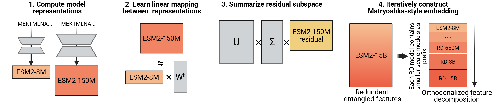

# PLM Reverse Distillation



Protein language models (PLMs) scale poorly: for many tasks, mid-sized models often outperform the largest in the same family. **Reverse Distillation** addresses this by decomposing large PLM representations into orthogonal subspaces guided by smaller models of the same family. The resulting embeddings have a Matryoshka-style nested structure — the first *k* dimensions of a larger model's embedding exactly match the smaller model's representation — ensuring larger reverse-distilled models consistently outperform smaller ones.

On ProteinGym benchmarks, reverse-distilled ESM-2 variants outperform their respective baselines at the same embedding dimensionality, with the reverse-distilled 15B model achieving the strongest performance.

## Installation

Reverse distillation can be installed via pip

```bash
pip install reverse_distillation
```

One of the requirements, `fbpca`, may be difficult to install via pip. In that, case install it separately via micromamba or conda and then try `pip install reverse_distillation` again

```bash
micromamba install -c conda-forge fbpca # OR
conda install -c conda-forge fbpca 
```

### Via Github
You can also clone the repository and install locally using [`uv`](https://github.com/astral-sh/uv). This is helpful for running bulk extraction scripts from the command line.

```bash
git clone https://github.com/rohitsinghlab/plm_reverse_distillation.git
cd plm_reverse_distillation
uv lock && uv sync
uv pip install -e '.[dev]'
source .venv/bin/activate
```

## Quick Start

Reveres Distilled ESM2 models are designed to be a drop-in replacement for ESM2 for most embedding-generation tasks.

```python
import esm
import torch
import reverse_distillation

# Load ESM-2 model
esm2_model, alphabet = esm.pretrained.esm2_t33_650M_UR50D()
rd_model, alphabet = reverse_distillation.pretrained.esm2_rd_650M()

batch_converter = alphabet.get_batch_converter()
esm2_model.eval()  # disables dropout for deterministic results
rd_model.eval()  # disables dropout for deterministic results

# Prepare data
data = [
    ("protein1", "MKTVRQERLKSIVRILERSKEPVSGAQLAEELSVSRQVIVQDIAYLRSLGYNIVATPRGYVLAGG"),
    ("protein2", "KALTARQQEVFDLIRDHISQTGMPPTRAEIAQRLGFRSPNAAEEHLKALARKGVIEIVSGASRGIRLLQEE"),
    ("protein2 with mask","KALTARQQEVFDLIRD<mask>ISQTGMPPTRAEIAQRLGFRSPNAAEEHLKALARKGVIEIVSGASRGIRLLQEE"),
    ("protein3",  "K A <mask> I S Q"),
]
batch_labels, batch_strs, batch_tokens = batch_converter(data)
batch_lens = (batch_tokens != alphabet.padding_idx).sum(1)

# Extract per-residue representations
with torch.no_grad():
    results_esm = esm2_model(batch_tokens, repr_layers=[33], return_contacts=True)
    results_rd = rd_model(batch_tokens)

esm_token_representations = results_esm["representations"][33]
rd_token_representations = results_rd["representations"]["650M"]

# Generate per-sequence representations via averaging
# NOTE: token 0 is always a beginning-of-sequence token, so the first residue is token 1.
sequence_representations = []
for i, tokens_len in enumerate(batch_lens):
    print(f"esm representation size: {esm_token_representations[i, 1 : tokens_len - 1].size()}")
    print(f"rd representation size: {rd_token_representations[i, 1 : tokens_len - 1].size()}")
```

Because Reverse Distillation operates on the final embeddings, the `representations` element of the results contains embeddings for each constituent model size, rather than different layers of the single model.

## Available Models

Pretrained scalers for all ESM-2 model pairs (8M → 35M → 150M → 650M → 3B → 15B) are available on [HuggingFace](https://huggingface.co/singhlab/plm_reverse_distillation) and can be loaded with `reverse_distillation.pretrained`.

All models use PCR regression and PCA for dimensionality reduction. Each model applies the full chain of scalers from ESM-2 8M up to the target size.

| Model name | Chain | Output dim |
| ---------- | ----- | ----------- |
| `esm2.rd/35M` | 8M → 35M | 480 |
| `esm2.rd/150M` | 8M → 35M → 150M | 640 |
| `esm2.rd/650M` | 8M → 35M → 150M → 650M | 1280 |
| `esm2.rd/3B` | 8M → 35M → 150M → 650M → 3B | 2560 |
| `esm2.rd/15B` | 8M → 35M → 150M → 650M → 3B → 15B | 5120 |

## Scripts

### Embedding extraction

Extract embeddings from a FASTA file using a pretrained RD model:

```bash
python scripts/extract.py \
    --fasta_file proteins.fasta \
    --output_dir embeddings/ \
    --repr_type mean \
    --batch_size 32
```

Key arguments: `--repr_type` (`per_tok` / `mean` / `bos`), `--repr_layers`, `--batch_size`, `--truncation_seq_length`.

### Training scalers

Train new scalers on your own data:

```bash
python scripts/train.py \
    --dataset_path proteins.fasta \
    --scalar_path scalers/ \
    --regressor_type pcr \
    --scaler_type rd \
    --n_pretrained_seqs 5000
```

Key arguments: `--regressor_type` (`linear` / `ridge` / `pcr`), `--scaler_type` (`rd` / `naive`), `--pca_type` (`incremental` / `fbpca`), `--n_pretrained_seqs`.

## Citation

If you use reverse distillation, please cite:

```bibtex
@inproceedings{catrina2026reverse,
  title   = {Reverse Distillation: Consistently Scaling Protein Language Model Representations},
  author  = {Catrina, Darius and Bepler, Christian and Sledzieski, Samuel and Singh, Rohit},
  booktitle = {International Conference on Learning Representations},
  year    = {2026}
}
```

## License

This project is licensed under the MIT License — see [LICENSE](LICENSE) for details.
